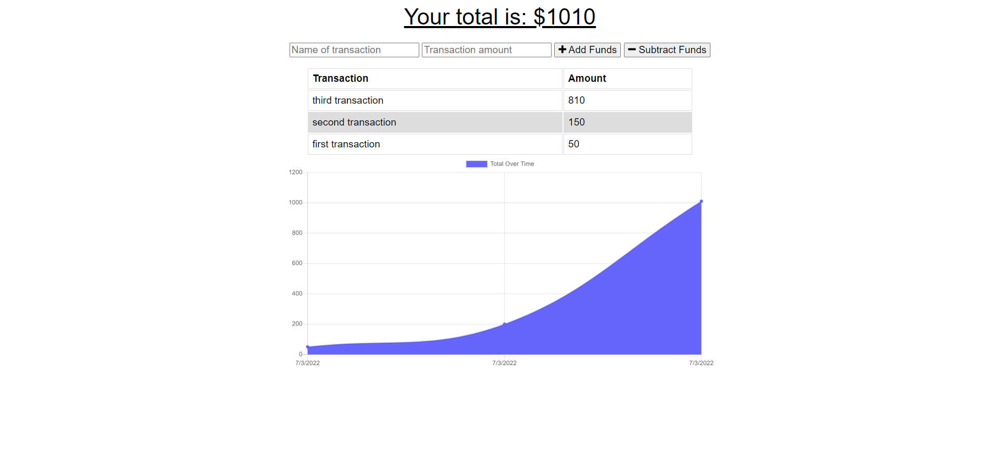

  # Track A Budget
  

  ## Description
  A budget-tracker PWA that will allow users to continue tracking their budget and make changes while also offline.
  
  [Access the link to the deployed application here!](https://protected-wildwood-15409.herokuapp.com/)
  

  

  ## Table of Contents
  * [Installation](#installation)
  * [Usage](#usage)
  * [License](#license)
  * [Contributing](#contributing)
  * [Tests](#tests)
  * [Questions](#questions)

  
  ## Installation 
  Follow these instructions to install the necessary dependences:
  Install `Node.js` and `MongoDB` to the computer that you'll be using, following the documentation listed on their respective websites.

  
  ## Usage 
  Follow these instructions to use the application properly:
  Clone the project to your machine.  After cloning, open up the repository using a text-editor like `VS Code`.  Afterwards, open up the command line and type `npm install` to install the necessary packages for `express` and `mongoose`, as they'll be used in the repo also.  When the necessary dependencies are installed, type `npm start` from the command line, and then access an api tool like `Insomnia` or `Postman` to test the routes created in the repository.  You could also visit `localhost:3001` in a browser to test the functionality of the app while offline by clicking `inspect` in a browser and throttling the connection to be `offline`.   
  
  
  ## License 

  **Track A Budget** is distributed under the [MIT](https://opensource.org/licenses/MIT) License
    

  
  ## Contributing
   Contributors: Malik Spruill

  
  ## Tests 
  Include these tools to properly run tests within the application:
  N/a
  
  
  ## Questions
  Have questions about the repo/application? Contact me:
  <a href="https://github.com/MalikSpruill" target="_blank">https://github.com/MalikSpruill</a> 
  Email: malikspruill@gmail.com
  
